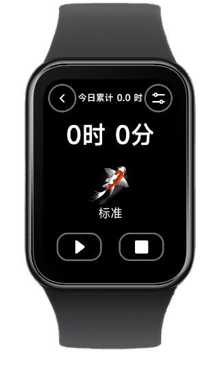
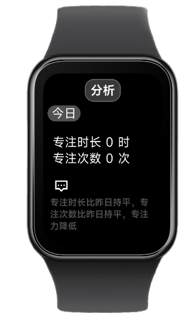
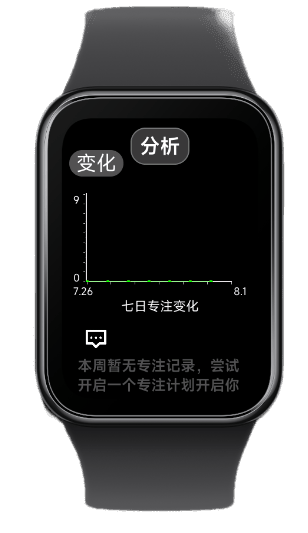
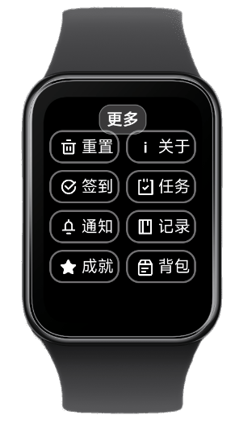

## 一禅

***基于xiaomi vela开发，在xiaomi band 9 pro进行测试和维护***

### 功能实现
- [x] 多模式计时
- [x] 专注历史查询
- [x] 通知系统
- [x] 专注分析
- [ ] 成就系统
- [ ] 任务系统和奖惩机制

### 特色
- 纯手绘资源
- 为应用单独设计的简洁数据库系统
- 应用内完善的动画和流畅体验

### 演示





更多内容请编译安装体验

--------


## 二次开发

### 1. 开发

```
npm install
npm run start
```

### 2. 构建

```
npm run build
npm run release
```

### 3. 调试

```
npm run watch
```
### 4. 代码规范化配置
代码规范化可以帮助开发者在git commit前进行代码校验、格式化、commit信息校验

使用前提：必须先关联git

macOS or Linux
```
sh husky.sh
```

windows
```
./husky.sh
```
